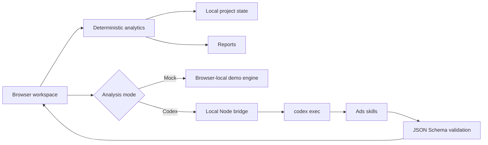

<div align="center">

# OpenAdOps

### Turn ad exports into defensible decisions.

OpenAdOps is a local-first AI workspace that turns Google Ads, Meta Ads, TikTok Ads, and AppsFlyer exports into campaign strategy, creative tests, optimization actions, and client-ready reports.

[](https://leol007.github.io/open-adops/)
[](./LICENSE)
[](https://nodejs.org/)

[简体中文](./README.md) · [English](./README.en.md) · [Roadmap](./ROADMAP.md) · [Contributing](./CONTRIBUTING.md)

</div>


## Why OpenAdOps

Paid-media work is fragmented across dashboards, spreadsheets, screenshots, and chat threads. A generic chat can draft an answer, but it does not preserve the operating context or guarantee the metric math.

OpenAdOps keeps the workflow in one project:

1. **Plan** — goals, markets, media roles, budgets, and test hypotheses.
2. **Create** — platform-aware creative angles, hooks, variables, and success metrics.
3. **Launch** — campaign architecture, naming, budgets, and pre-flight checks.
4. **Optimize** — deterministic KPI calculation plus evidence-backed AI recommendations.
5. **Report** — management-ready HTML and print/PDF output.

## What makes it different

- **Code does the math.** CSV parsing, field mapping, aggregation, CPI, AF-CPI, CTR, CVR, CPA, ROAS, and retention are deterministic.
- **AI does the judgment.** Strategy, diagnosis, creative tests, and next actions are returned as schema-validated JSON.
- **Evidence stays attached.** Every finding separates evidence, diagnosis, action, confidence, and validation.
- **Local-first by design.** Projects live in browser storage; raw CSV rows are not sent to the AI bridge.
- **Safe failure behavior.** A failed AI request produces an explicit error instead of a fabricated recommendation.
- **Useful without an account.** The browser-local Mock demo works on GitHub Pages and does not require Codex or an API key.

## 60-second start

### Try the browser demo

Open the [live Mock demo](https://leol007.github.io/open-adops/). It runs entirely in the browser with clearly labeled demo data.

### Run locally

```bash
git clone https://github.com/leoL007/open-adops.git
cd open-adops
npm start
```

Open <http://127.0.0.1:4173>. No `npm install` is required; the project uses Node.js built-in modules only.

Run a quick environment check:

```bash
npm run doctor
```

## AI modes

| Mode | Requirements | What happens |
| --- | --- | --- |
| Browser-local Mock | None | Generates deterministic, clearly labeled demo recommendations without a server AI call. |
| Codex CLI | Signed-in Codex CLI | Sends project context and aggregated metrics through the local Node bridge to `codex exec`. |

OpenAdOps uses the model configured in Codex by default. Override it only when needed:

```bash
OPENADOPS_MODEL=your-model-name npm start
```

For deeper paid-media reasoning, install a compatible Ads skill such as [Claude Ads](https://github.com/AgriciDaniel/claude-ads) for your agent runtime. OpenAdOps remains usable in Mock mode without it.

## CSV input

CSV import requires `Spend` plus at least one of `Media Installs` or `AF Installs`. Recommended fields:

| Dimension fields | Metric fields |
| --- | --- |
| Date, Platform, Country, Campaign, Ad group / Ad set, Creative | Spend, Impressions, Clicks, Media Installs, AF Installs, Conversions, Revenue, D1 Retained |

OpenAdOps auto-detects common English and Chinese field aliases and lets the user correct each mapping before calculation. See [the demo CSV](./public/data/openadops-demo.csv).

## Architecture



The browser never stores an API key. The local service calls Codex with an argument array, an ephemeral session, a read-only sandbox, and a required JSON Schema. Only one Codex analysis job runs at a time.

## Validation

```bash
npm test
```

Tests cover quoted CSV parsing, field detection, media CPI versus AppsFlyer CPI, metric aggregation, Mock output, and analysis-schema validation. The test suite never calls a real model.

## Current scope

- Direct CSV import; XLSX can be exported to CSV first.
- Local browser persistence; no multi-user sync yet.
- Strategy and recommendation generation only; no live ad-account mutations.
- Google Ads, Meta Ads, TikTok Ads, and AppsFlyer-oriented App UA workflow.
- Attribution windows, event definitions, and profit assumptions still require operator confirmation.

## Project status

OpenAdOps is an early public release built in the open. See the [roadmap](./ROADMAP.md), open a [feature request](https://github.com/leoL007/open-adops/issues/new?template=feature_request.yml), or contribute a platform/data adapter.

## License

[MIT](./LICENSE). OpenAdOps is an independent open-source project and is not affiliated with Google, Meta, TikTok, AppsFlyer, or OpenAI.
