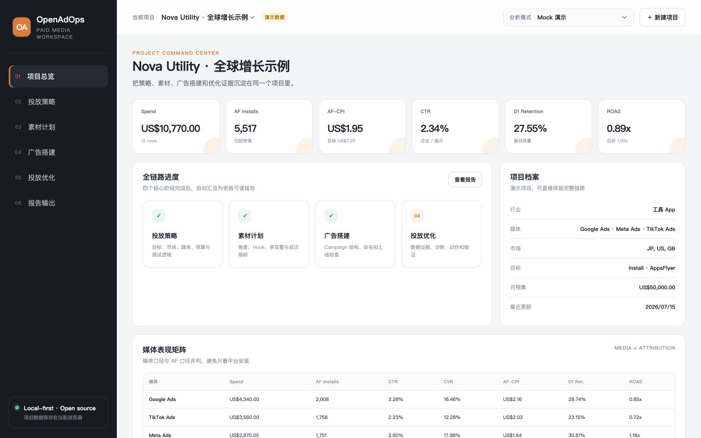

<div align="center">

# OpenAdOps

### 从客户碎片信息到有证据、可执行、可验证的投放策略

OpenAdOps 是一个本地优先的 AI 付费媒体工作台，把客户 Offer、零散策略以及 Google Ads、Meta Ads、TikTok Ads 和 AppsFlyer 数据转化为结构化 Brief、投前作战包、实验账本、优化动作与客户报告。

[](https://leol007.github.io/open-adops/)
[](./LICENSE)
[](https://nodejs.org/)
[](https://github.com/leoL007/open-adops/releases)

[简体中文](./README.md) · [English](./README.en.md) · [产品定义](./PRODUCT.md) · [路线图](./ROADMAP.md) · [参与贡献](./CONTRIBUTING.md)

</div>



## 为什么需要 OpenAdOps

投放工作通常分散在媒体后台、Excel、截图、群聊和临时文档中。通用聊天工具可以生成文字，却不会持续保存项目上下文，也无法保证指标计算准确。

OpenAdOps 把完整投放链路放进一个项目：

1. **需求接收（Intake）**：粘贴客户 Offer 和零散策略，标记已确认、AI 推断与缺失信息。
2. **策略（Plan）**：生成客户追问、Strategy v0、媒体分工、预算场景和测试假设。
3. **素材（Create）**：生成适配平台的素材角度、Hook、测试变量和成功指标。
4. **投前（Launch Pack）**：形成 Campaign 蓝图、媒体预算、素材生产 Brief、监测口径、上线 Gate 和首 7 天计划。
5. **实验（Experiment Ledger）**：将素材与投放假设排成 Now / Next / Later 队列，计算样本门槛并记录学习。
6. **优化（Optimize）**：代码计算 KPI，AI 基于证据给出判断和下一步动作。
7. **报告（Report）**：输出管理层或客户可读的 HTML 与打印/PDF 报告。

## 与普通 AI 对话有什么不同

- **代码负责计算**：CSV 指标、实验样本量、预计周期和相对变化由确定性代码完成。
- **AI 负责判断**：策略、诊断、素材测试和下一步动作以经过 JSON Schema 校验的结构化结果返回。
- **证据始终跟随结论**：每条判断分别呈现证据、诊断、动作、置信度和验证方式。
- **未知信息不会被偷偷补全**：Brief 明确区分客户已确认、AI 推断和资料缺失。
- **投前交付物可直接使用**：Campaign 命名、优化事件、出价前置条件、素材单变量和负责人被放进同一份作战包。
- **上线阻塞项有责任人**：每个 Gate 都有状态、Owner 和所需证据，存在 Blocker 时不会显示“可上线”。
- **实验没有结果也有价值**：未达到样本门槛时记录为 Inconclusive，不把短期波动包装成 Winner。
- **本地优先**：项目保存在浏览器中，原始 CSV 明细不会发送给 AI Bridge；粘贴资料只在用户主动运行时提交给本地 Codex。
- **失败时不编造结果**：AI 请求失败会显示明确错误，而不是生成看似合理的虚假建议。
- **无需账号也能体验**：GitHub Pages 上的 Browser-local Mock Demo 不依赖 Codex 或 API Key。

## 60 秒开始

### 在线体验

打开[在线 Mock Demo](https://leol007.github.io/open-adops/)。它完全在浏览器中运行，并使用有明确标记的演示数据。

### 本地运行

```bash
git clone https://github.com/leoL007/open-adops.git
cd open-adops
npm start
```

启动成功后，在浏览器访问本地工作台：`http://127.0.0.1:4173`。项目只使用 Node.js 原生模块，不需要运行 `npm install`。

运行完整检查：

```bash
npm run check
```

`npm run check` 会校验版本一致性、运行全部测试并检查本地环境。

## AI 模式

| 模式 | 要求 | 工作方式 |
| --- | --- | --- |
| Browser-local Mock | 无 | 生成确定性、明确标记的演示建议，不调用服务端 AI。 |
| Codex CLI | 本机已登录 Codex CLI | 本地 Node Bridge 将粘贴资料、项目上下文和聚合指标发送给 `codex exec`。 |

OpenAdOps 默认使用 Codex 当前配置的模型。如有需要，可以通过环境变量指定：

```bash
OPENADOPS_MODEL=your-model-name npm start
```

复杂作战包如果继承了过高的全局推理强度，可能超过默认 4 分钟。可以单独为 OpenAdOps 调整推理强度与超时，不影响 Codex 的全局配置：

```bash
OPENADOPS_REASONING_EFFORT=high OPENADOPS_TIMEOUT_MS=360000 npm start
```

如需更深入的付费媒体分析，可以为 Agent Runtime 安装兼容的 Ads Skill，例如 [Claude Ads](https://github.com/AgriciDaniel/claude-ads)。即使不安装，OpenAdOps 仍可使用 Mock 模式。

## Launch Pack

在“投前作战包”页面，可以把 Offer Intake 与 Strategy v0 转换为：

- 媒体角色、预算占比与金额。
- 可直接搭建的 Campaign 名称、目标、优化事件、市场、出价和拆分逻辑。
- 按媒体生成的素材生产 Brief，包含假设、Hook、格式、变体、单一变量和成功指标。
- 媒体实时反馈、MMP 归因和业务后台最终口径。
- 带负责人和证据要求的上线 Gate。
- Day 0、Day 1–3、Day 4–7 行动与决策规则。
- Markdown、独立 HTML 和本地版本快照。

预算缺失时不会生成虚假金额；金融业务会将牌照、当地政策、免责声明和平台限制作为上线前置条件。

## Experiment Ledger

“实验台”会把 Launch Pack 的素材 Brief 转换为跨媒体测试队列：

- 每个实验只改变一个主要变量，并预先冻结 Control、Variant、主指标和护栏指标。
- Google App、Meta、TikTok 分别使用适合自己的原生实验方法，不用手工复制广告组冒充随机实验。
- 对比例指标由代码计算样本量和预计周期；缺少基准率或流量时保持为空。
- 结果页记录原生实验证据、Winner / Loser / Inconclusive、学习结论和下一步动作。
- 支持 Markdown、独立 HTML、本地版本快照，并自动进入管理层报告。

计算方法和平台边界见 [Experiment Ledger 方法](./docs/EXPERIMENTS.md)。

## CSV 输入

导入 CSV 时必须包含 `Spend`，并至少包含 `Media Installs` 或 `AF Installs` 其中一项。建议字段如下：

| 维度字段 | 指标字段 |
| --- | --- |
| Date, Platform, Country, Campaign, Ad group / Ad set, Creative, Conversion Event | Spend, Impressions, Clicks, Media Installs, AF Installs, Conversions, Revenue, D1 Retained |

OpenAdOps 会自动识别常见的中英文字段别名，并允许用户在计算前修正每一项映射。可查看[演示 CSV](./public/data/openadops-demo.csv)。

## 验证

```bash
npm run check
```

33 项测试覆盖需求接收、Launch Pack、Experiment Ledger、金融合规阻塞、小预算媒体收敛、实验样本计算、事件身份、媒体别名合并、缺失数据保护、CSV 解析、日期范围、媒体 CPI 与 AppsFlyer CPI、指标聚合和 Schema 校验。测试过程不会调用真实模型。

## 当前范围

- 直接导入 CSV；XLSX 可先导出为 CSV。
- 需求接收支持粘贴文本；暂不包含 OCR 或文档解析。
- 项目保存在当前浏览器，暂不支持多人同步。
- 只生成策略、实验计划和建议，不连接或修改真实广告账户。
- 当前聚焦 Google Ads、Meta Ads、TikTok Ads 和 AppsFlyer 相关的 App UA 工作流。
- 归因窗口、事件定义和利润口径仍需优化师人工确认。

产品定位、参考产品、实验方法、固定案例、决策记录与发布方式分别见 [PRODUCT.md](./PRODUCT.md)、[产品参考](./docs/BENCHMARKS.md)、[实验方法](./docs/EXPERIMENTS.md)、[验收案例](./docs/USER_CASES.md)、[决策记录](./docs/DECISIONS.md) 和 [发布规范](./docs/RELEASING.md)。

## 项目状态

OpenAdOps 仍处于早期公开版本。你可以查看[路线图](./ROADMAP.md)、提交[功能建议](https://github.com/leoL007/open-adops/issues/new?template=feature_request.yml)，或贡献新的媒体与数据适配器。

## License

[MIT](./LICENSE)。OpenAdOps 是独立开源项目，与 Google、Meta、TikTok、AppsFlyer 或 OpenAI 无隶属关系。
