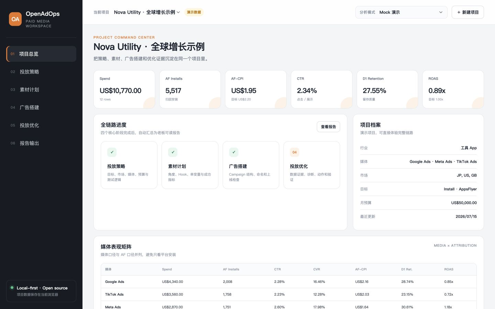

<div align="center">

# OpenAdOps

### 从客户碎片信息，到有证据、可执行、可验证的投放决策

OpenAdOps 是面向海外广告优化师的**本地优先** AI 投放工作台：把客户资料、零散投放意见，以及 Google Ads、Meta Ads、TikTok Ads、AppsFlyer 数据，整理成策略初稿、素材需求、上线执行清单、实验账本、优化判断与客户报告。

[](https://leol007.github.io/open-adops/)
[](./LICENSE)
[](https://nodejs.org/)
[](https://github.com/leoL007/open-adops/releases)

[简体中文](./README.md) · [English](./README.en.md) · [产品定义](./PRODUCT.md) · [路线图](./ROADMAP.md) · [参与贡献](./CONTRIBUTING.md)

</div>



## 当前版本（v0.6.1）

- **完整主链路**：需求接收 → 策略初稿 → 可选搭建策略 → **素材需求** → **上线执行** → **实验账本** → 投放优化 → 报告输出
- **三档 AI 模式**：本地演示、Grok 4.5 与 GPT 5.6；本机 Bridge 按任务路由并校验结构化结果
- **中文界面优先**：按钮、状态、生成提示与产品模块名统一中文；行业词保留英文（如 Google Ads、CPI、ROAS、CSV）
- **任务级智能路由**：投放前策略清单与快速策略用轻量模型；深度复核与上线执行用更强模型；结构校验失败可自动复核
- **目标按需配置**：媒体 CPI、AF-CPI、CPA、ROAS 可独立添加或删除，并区分「仅观察 / 测试阈值 / 正式目标」；学习期无需填写假 KPI
- **搭建策略按需启用**：不需要单独策略的项目可以直接跳过；需要时按 Campaign / Ad group / Ad 录入参数并导出 Excel
- **代码算数、AI 做判断**：指标与实验样本量由确定性代码计算，避免「看起来很专业」的假精度
- **工作区备份**：顶栏可「导出当前 / 导出全部 / 导入备份」JSON，换机或清浏览器可恢复
- **模型信息一致**：所有生成入口、状态与结果统一显示 Terra / Sol 和推理档，不再重复或隐藏模型名
- **优化诊断使用 Sol**：投放优化单独使用 Sol 高推理；策略与素材判断继续使用 Terra 中档
- **素材需求可交接**：按真实设计需求单整理参考、文案、修改备注与数量需求；AI 提出候选补充，确认后可直接复制为飞书表格
- **映射模板可复用**：常用媒体 / AppsFlyer 报表映射可保存到工作区，相同表头自动套用，并随完整工作区备份迁移
- **周期对比可追溯**：选择两个不重叠日期区间，由代码计算花费、安装、CPI、CPA、ROAS 的同口径变化
- **优化决策有历史**：每次诊断保留当时的数据区间、聚合指标、模型建议与人工复核状态，可在报告中追溯
- **优化动作能闭环**：把诊断拆成逐条动作，分别确认、执行和验证；素材、归因、实验类动作可流转到对应工作区
- **Codex 失败可诊断**：区分退出码与终止信号，隐藏无关 Skill 日志，并按任务缩小 Skill 加载范围
- **本地运行更可靠**：工作区迁移失败保住已读取项目；AI 取消、服务离线和异常响应都有明确状态
- **旧进程可识别**：页面与本机 Bridge 版本不一致时提示重启；4173 端口被占用时给出直接处理方式
- **本地路由更稳健**：畸形 Host 或非法请求地址不会拖垮整个工作台服务
- **日期口径可审计**：不存在的日历日期不进入周期与对比；受影响行仍保留在总计并明确提示
- **坏表不静默通过**：重复表头或未闭合引号在读取阶段直接报错，不生成残缺指标
- **零值不冒充效率**：零分母的 CPI / CPA / CTR 等显示为不可计算，真实 0 与缺失证据严格分开
- **演示也不编 KPI**：只有已配置 AF-CPI 阈值时才使用倍数暂停规则；仅观察与缺失目标保持学习期表述
- **异常数值不静默归零**：已映射列里的 `N/A`、`--` 等内容会阻止导入并按字段提示；空白值单独计数
- **数据质量可追溯**：空白数值与无效日期持续显示在优化页、报告和对应的优化诊断历史中
- **导入完整性更严格**：错列 CSV、损坏千分位、尾随字符日期和畸形备份在进入项目之前被明确拒绝
- **归因指标不串线**：AF 安装已映射但为 0 时，CVR 与 D1 留存不会借用媒体安装作为分母或分子

## 为什么需要 OpenAdOps

投放工作通常散落在媒体后台、Excel、截图、群聊和临时文档里。通用聊天可以写字，却很难：

- 持续保存项目上下文  
- 分清「客户已确认 / AI 推断 / 资料缺失」  
- 保证 CPI、AF-CPI、样本量等计算口径正确  

OpenAdOps 把一条完整链路放进同一个本地项目：

1. **需求接收**：粘贴客户资料与投放意见，整理结构化简报与优化师投放前策略清单
2. **策略初稿**：生成带假设的前期策略（可快速生成，也可深度复核）  
3. **搭建策略（可选）**：记录 Campaign、Ad group、事件、出价、版位、排除、素材数量与复盘口径，导出 Excel
4. **素材需求**：继承上游资料，由 AI 提示制作边界与候选需求，优化师确认后复制到飞书云文档
5. **上线执行**：汇总已确认配置，检查账户、归因、素材和合规阻塞，生成 Day 0–7 动作
6. **实验账本**：本轮 / 下轮 / 候选队列，样本门槛、停止规则、证据与学习
7. **投放优化**：导入 CSV，代码算 KPI，再基于证据生成诊断；逐条确认动作、流转任务并记录前后周期验证结论
8. **报告输出**：管理层 / 客户可读的 HTML 与打印 / PDF，包含最近优化动作、状态与验证记录

## 和普通 AI 对话有什么不同

- **代码负责计算**：CSV 指标、实验样本量、预计周期、相对变化  
- **AI 负责判断**：策略、诊断、素材测试、下一步动作，且输出受 JSON Schema 约束  
- **证据跟着结论走**：证据、诊断、动作、置信度、验证方式分开呈现  
- **未知信息不偷偷补全**：已确认 / 推断 / 缺失状态可见  
- **学习期不强填 KPI**：可以只选衡量指标并留空阈值；0 不会被当成目标，未确认阈值不会进入止损或扩量规则
- **上线执行不重做策略**：只读取前面已确认的媒体、事件、出价、预算和素材需求
- **上线检查项有责任人**：存在阻塞项时不会显示「可上线」  
- **无结论也是结论**：达不到样本门槛记为「无明确结论」，不包装成赢家  
- **本地优先**：项目在浏览器本地；原始 CSV 明细不送进 AI；粘贴资料仅在你主动运行时提交给本机模型  
- **失败不编造**：模型失败会明确报错，而不是假装成功  
- **无账号也能体验**：[GitHub Pages 本地演示](https://leol007.github.io/open-adops/) 不依赖 Codex 或 API Key  

## 60 秒开始

### 在线体验（仅演示）

打开 [在线演示](https://leol007.github.io/open-adops/)。纯浏览器运行，使用明确标注的演示数据；**不能**调用本机模型。

### 本地运行（完整能力）

```bash
git clone https://github.com/leoL007/open-adops.git
cd open-adops
npm start
```

浏览器打开：`http://127.0.0.1:4173`  

只需 Node.js 原生模块，**不需要** `npm install`。

OpenAdOps 会自动从 `CODEX_BIN`、PATH、ChatGPT App 和 Codex 插件目录寻找 Codex CLI；应用更新导致 PATH 变化时，无需手动改代码。仍可用 `CODEX_BIN="/绝对路径/codex" npm start` 强制指定。

完整检查：

```bash
npm run check
```

## 分析模式

| 界面名称 | 要求 | 作用 |
| --- | --- | --- |
| **本地演示** | 无 | 确定性演示结果，不耗模型额度 |
| **Grok 4.5** | 本机已安装并登录 Grok CLI | 经本地 Node Bridge 调用 `grok`，统一使用 Grok 4.5 高推理 |
| **GPT 5.6** | 本机已登录 Codex CLI | 经本地 Node Bridge 调用 `codex exec`，按任务选择 Terra / Sol 与推理档 |

任务级默认路由（不会继承全局 Codex 的超高推理配置）：

| 任务 | 默认模型 | 推理档 |
| --- | --- | --- |
| 生成投放前策略清单 | `gpt-5.6-terra` | 低 |
| 快速生成策略初稿 | `gpt-5.6-terra` | 中 |
| 深度复核策略初稿 | `gpt-5.6-sol` | 高 |
| 策略判断 | `gpt-5.6-terra` | 中 |
| 生成素材需求建议 | `gpt-5.6-terra` | 中 |
| 投放优化诊断 | `gpt-5.6-sol` | 高 |
| 生成上线执行清单 | `gpt-5.6-sol` | 高 |
| 生成实验账本 | `gpt-5.6-terra` | 中 |

Terra 输出若未过结构校验，会自动用 `gpt-5.6-sol + 中` 复核一次。界面会区分 GPT-5.6 Terra / Sol、推理档、耗时与预计区间，并支持取消；失败原因会常驻提示。

仅覆盖 OpenAdOps 路由、不改 Codex 全局配置：

```bash
OPENADOPS_TERRA_MODEL=gpt-5.6-terra OPENADOPS_DEEP_MODEL=gpt-5.6-sol npm start
```

兼容旧变量：`OPENADOPS_MODEL`、`OPENADOPS_REASONING_EFFORT`、`OPENADOPS_TIMEOUT_MS`（设置后可能覆盖全部任务，请谨慎）。

可选安装兼容的 Ads Skill（如 [Claude Ads](https://github.com/AgriciDaniel/claude-ads)）增强分析；不安装也可使用本地演示模式。

## 素材需求

在「素材需求」页，把上游资料整理成与设计团队日常表格一致的制作需求：

- 媒体与市场使用项目级信息，不在每条素材里重复填写
- 每条只记录素材参考、文案、修改备注和数量需求
- 素材参考由优化师手动填写；当前 AI 不负责寻找视频或素材，因此 AI 建议中的该字段始终留空
- 共性制作边界集中写在默认折叠的「给设计的统一要求」，仅作为全局备注，不会占用飞书表格的素材行
- 点击页头「AI 生成素材建议」后，在右侧抽屉填写补充重点、查看风险并采纳建议行
- AI 候选需由优化师逐条采纳；上线执行不会反向覆盖正式素材需求
- 点击「复制飞书表格」后直接粘贴到飞书云文档；输出是 5 列富文本表格，不是长篇 Markdown 文档
- 图片和视频文件不写入浏览器存储，可在飞书表格中继续补充缩略图或附件

## 上线执行

在「上线执行」页汇总上游已确认内容，只处理投放前最后一道检查：

- 上线摘要：媒体、市场、搭建状态、优化事件、出价、预算、素材需求和归因口径
- 媒体反馈 / MMP 归因 / 业务后台三层口径
- 上线检查项：状态、负责人、证据；金融场景含合规前置
- Day 0、Day 1–3、Day 4–7 行动与决策规则
- 状态只显示可上线 / 有条件上线 / 暂不可上线，不展示百分制假精确
- 不再重复展示媒体策略、Campaign 蓝图或素材简报

## 实验账本

在「实验台」页，把已确认素材需求与上线口径排成测试队列：

- 每个实验只改一个主变量；预先冻结对照组、实验组、主指标与护栏  
- 分别对应 Google App 素材实验、Meta A/B、TikTok Split Testing 等原生方式  
- 比例指标由代码计算样本量与周期；缺基准率或流量时保持「不可计算」  
- 记录证据、胜负 / 无明确结论、学习与下一步  
- 导出文档 / 网页，并回写管理报告  

方法说明见 [实验方法](./docs/EXPERIMENTS.md)。

## CSV 输入

必须包含 **Spend（花费）**，并至少有 **Media Installs（媒体安装）** 或 **AF Installs（AF 安装）** 之一。

| 维度字段 | 指标字段 |
| --- | --- |
| Date, Platform, Country, Campaign, Ad group / Ad set, Creative, Conversion Event | Spend, Impressions, Clicks, Media Installs, AF Installs, Conversions, Revenue, D1 Retained |

- 自动识别常见中英文字段别名，计算前可手工改映射  
- 当前映射可保存为工作区模板；再次导入相同表头时自动套用，部分匹配时明确显示匹配数
- **媒体安装与 AF 安装分开映射**：仅有 AF 列时不会误当成媒体安装，避免 CPI 与 AF-CPI 假一致  
- 已映射数值列会先做质量检查；非法非空值阻止导入，空白值按 0 计入并明确提示数量
- 映射日期后可比较对比期与本期；两个区间必须独立，原始行不写入项目，只保存聚合结果
- 演示数据：[openadops-demo.csv](./public/data/openadops-demo.csv)  

## 验证

```bash
npm run check
```

当前 **153** 项自动化测试覆盖：需求接收、素材需求校验与飞书表格复制、上线执行、实验账本、逐条优化动作、前后周期变化、优化决策历史、工作区备份与迁移保护、AI 请求错误、Codex CLI 自动发现、运行时版本校验、启动错误、请求地址解析、日历日期校验、CSV 行宽与数值质量、数据质量状态、预算占比、不可计算指标、Mock KPI 边界、静态服务边界、CSV 映射模板、周期对比、模型路由与标识、可选绩效目标、金融合规阻塞、小预算收敛、样本计算、转化事件身份、媒体别名合并、缺失数据保护、AF/媒体安装映射、媒体 CPI 与 AF-CPI、聚合与 Schema 校验。测试**不会**调用真实模型。

## 当前范围

- 直接导入 CSV；XLSX 请先导出为 CSV  
- 需求接收支持粘贴文本；暂无 OCR / 文档解析  
- 项目保存在当前浏览器；暂无多人同步  
- 只生成策略、计划与建议，**不**连接或修改真实广告账户  
- 聚焦 Google / Meta / TikTok + AppsFlyer 的 App UA 工作流  
- 归因窗口、事件定义、利润口径仍需优化师确认  

更多文档：[PRODUCT.md](./PRODUCT.md) · [产品参考](./docs/BENCHMARKS.md) · [实验方法](./docs/EXPERIMENTS.md) · [验收案例](./docs/USER_CASES.md) · [决策记录](./docs/DECISIONS.md) · [发布规范](./docs/RELEASING.md)

## 项目状态

OpenAdOps 仍是早期公开版本。欢迎查看 [路线图](./ROADMAP.md)、提交 [功能建议](https://github.com/leoL007/open-adops/issues/new?template=feature_request.yml)，或贡献媒体 / 数据适配。

## License

[MIT](./LICENSE)。OpenAdOps 是独立开源项目，与 Google、Meta、TikTok、AppsFlyer、OpenAI 无隶属关系。
