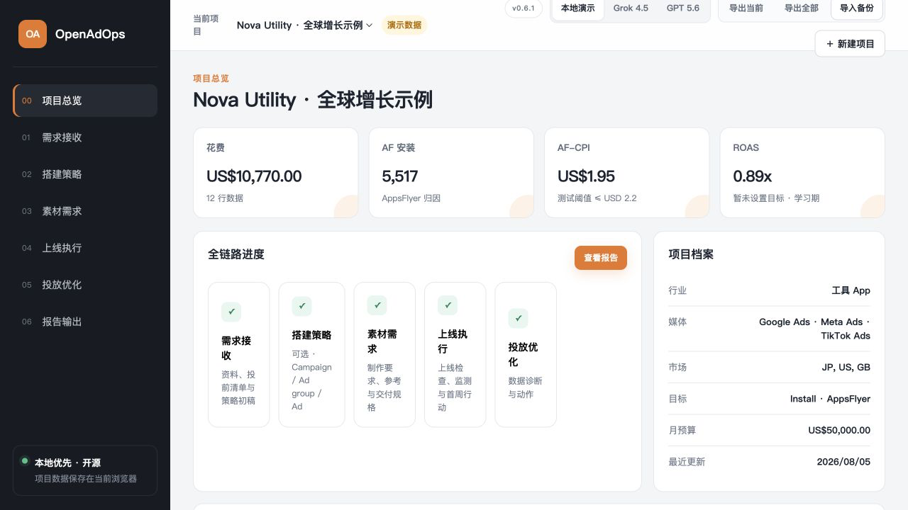
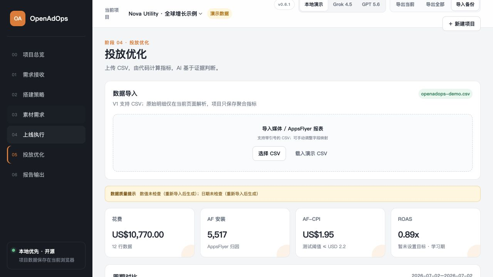

<div align="center">

# OpenAdOps

### API / 本机 CLI 双模式的海外广告投放工作台

把客户 Offer、投放要求与媒体数据，整理成**素材需求、上线清单、优化动作和客户报告**。

[](https://openadops-workspace.leoliu-tech.chatgpt.site)
[](./docs/INSTALL.md)
[](https://leol007.github.io/open-adops/)
[](https://github.com/leoL007/open-adops/releases/latest)

[](https://github.com/leoL007/open-adops/actions/workflows/test.yml)
[](https://github.com/leoL007/open-adops/releases)
[](./LICENSE)
[](https://nodejs.org/)

[简体中文](./README.md) · [English](./README.en.md) · [产品定义](./PRODUCT.md) · [路线图](./ROADMAP.md) · [参与贡献](./CONTRIBUTING.md)

</div>



> 在线工作台可连接使用者自己的 OpenAI 或 xAI API；本地完整版继续支持 Codex CLI 与 Grok CLI。GitHub Pages 仅保留为不调用模型的 Mock 演示。

## 为什么需要 OpenAdOps

海外投放工作通常散落在媒体后台、Excel、截图、群聊和临时文档里。通用 AI 可以生成文字，却很难持续保存项目上下文、守住指标口径，并把建议变成可追溯的动作。

| 真实问题 | OpenAdOps 的处理方式 |
| --- | --- |
| 客户资料零散，缺失信息容易被脑补 | 区分已确认、推断与缺失，不编造预算和 KPI |
| 素材需求、上线准备和优化记录彼此割裂 | 在同一项目里串起从接收到报告的工作流 |
| CPI、AF-CPI、CPA、ROAS 容易混算 | 由确定性代码计算，AI 只负责判断与建议 |
| AI 建议难以落地和复盘 | 每条动作由优化师确认、执行、验证或拒绝 |

## 一条真实的投放工作流

```text
需求接收 → 搭建策略（可选）→ 素材需求 → 上线执行 → 投放优化 → 报告输出
```

| 阶段 | 交付物 |
| --- | --- |
| **需求接收** | 结构化项目 Brief 与优化师投放前清单 |
| **搭建策略（可选）** | Campaign / Ad group / Ad 参数与 Excel |
| **素材需求** | 给设计团队的参考、文案、修改备注与数量需求 |
| **上线执行** | 上线状态、归因口径、检查项和 Day 0–7 动作 |
| **投放优化** | 同口径 KPI、周期对比、诊断与逐条优化动作 |
| **报告输出** | 管理层 / 客户可读的 HTML、打印与 PDF |

## 看看实际工作台

| AI 素材建议 | 上线执行 |
| --- | --- |
|  |  |

### 投放优化



## 它和普通 AI 对话有什么不同

- **代码算数**：花费、安装、AF 安装、CPI、AF-CPI、CPA、ROAS 与周期变化由代码计算。
- **AI 做判断**：策略、素材边界、上线风险和优化建议受 JSON Schema 约束。
- **优化师做决定**：AI 候选不会自动覆盖正式内容，每条动作都需要人工复核。
- **证据跟着结论走**：数据区间、聚合指标、模型、判断、状态和验证结论可以追溯。
- **未知信息保持未知**：学习期可以只观察指标，不要求填写假目标。
- **失败不伪装成功**：模型退出、超时、结构错误与服务离线都有明确状态。

## 两种运行方式，项目数据仍由你控制

```text
在线：浏览器工作台 → OpenAdOps 同源代理 → 使用者自己的 OpenAI / xAI API
本地：浏览器工作台 → 本机 OpenAdOps Bridge → 使用者自己的 Codex / Grok CLI
```

- 项目保存在当前浏览器；支持导出和恢复工作区备份。
- 原始 CSV 明细仅在当前页面解析，项目只保存聚合指标。
- 在线模式的 API Key 只保存在当前页面内存，刷新即清除，不进入 localStorage、项目备份或 Git。
- 在线请求会携带 Key 经过 OpenAdOps 同源代理，再转发到所选官方 API；建议使用独立项目 Key 并设置合理额度。
- 本地版不上传或共享 Codex / Grok 登录文件，CLI 仍在使用者电脑上运行。
- 不连接、不修改真实广告账户；上线与优化动作始终由人工执行。

## 60 秒开始

### 在线完整版

1. 打开 [OpenAdOps 在线工作台](https://openadops-workspace.leoliu-tech.chatgpt.site)。
2. 选择 **API**，连接自己的 OpenAI API 或 xAI API。
3. 测试连接后即可生成策略、素材建议、上线清单和优化诊断。

不想使用 API 时，可以打开 [GitHub Pages Mock 演示](https://leol007.github.io/open-adops/) 查看完整流程，不产生模型费用。

### 本地完整版

1. 打开 [Releases](https://github.com/leoL007/open-adops/releases) 并下载完整项目。
2. 确认电脑已安装 Node.js 20+ 和 Codex CLI。
3. 首次使用运行 `codex login`，登录自己的 ChatGPT / Codex 账号。
4. macOS 双击 `打开 OpenAdOps.command`；Windows 双击 `OpenAdOps.cmd`。
5. 启动器检查环境后会自动打开 `http://127.0.0.1:4173`。

完整步骤与故障排查见 [本地完整版安装说明](./docs/INSTALL.md)。

<details>
<summary><strong>开发者：使用终端启动</strong></summary>

```bash
git clone https://github.com/leoL007/open-adops.git
cd open-adops
npm start
```

OpenAdOps 只使用 Node.js 原生模块，无需 `npm install`。

</details>

## AI 模式

| 界面名称 | 要求 | 作用 |
| --- | --- | --- |
| **本地演示** | 无 | 确定性 Mock，不耗模型额度 |
| **API** | 自己的 OpenAI 或 xAI API Key | 在线版可用；Key 仅保留在当前页面会话 |
| **Grok CLI** | 本地版已安装并登录 Grok CLI | 本机 Bridge 调用 Grok 4.5 高推理 |
| **Codex CLI** | 本地版已登录 Codex CLI | 按任务选择 Terra / Sol 与推理档 |

<details>
<summary><strong>查看 GPT 5.6 任务路由</strong></summary>

| 任务 | 默认模型 | 推理档 |
| --- | --- | --- |
| 投放前策略清单 | `gpt-5.6-terra` | 低 |
| 快速策略与素材建议 | `gpt-5.6-terra` | 中 |
| 深度策略复核 | `gpt-5.6-sol` | 高 |
| 投放优化诊断 | `gpt-5.6-sol` | 高 |
| 上线执行清单 | `gpt-5.6-sol` | 高 |

Terra 输出未通过结构校验时，会使用 Sol 中档自动复核一次。界面显示实际模型、推理档、耗时与失败原因。

</details>

## 数据输入与指标边界

CSV 必须包含 **Spend（花费）**，并至少有 **Media Installs（媒体安装）** 或 **AF Installs（AF 安装）** 之一。

- 自动识别常见中英文字段，可手动修正并保存映射模板。
- 媒体安装与 AF 安装分开映射，避免 CPI 与 AF-CPI 假一致。
- 无效数字、错列 CSV、非法日期与损坏备份会在进入项目之前被拒绝。
- 零分母的效率指标保持“不可计算”，不会显示成假 0。
- 两个不重叠周期可比较花费、安装、CPI、CPA 与 ROAS 的同口径变化。

演示数据：[openadops-demo.csv](./public/data/openadops-demo.csv)

## 当前边界

- 支持 CSV；XLSX 请先导出为 CSV。
- 支持粘贴文字资料；暂不提供 OCR 和通用文档解析。
- 项目保存在浏览器；暂不提供多人实时协作。
- 素材参考由优化师填写；AI 暂不负责搜索视频或竞品素材。
- 聚焦 Google Ads、Meta Ads、TikTok Ads 与 AppsFlyer 的 App UA 工作流。
- 归因窗口、事件定义与利润口径仍需优化师人工确认。

## 质量与验证

```bash
npm run check
```

当前有 **171 项确定性测试**，覆盖公网 API 代理、部署构建、跨平台启动器、模型路由、Schema、素材需求、上线执行、CSV 质量、指标计算、周期对比、优化动作、备份与迁移。测试不会调用真实模型。

## 项目状态

OpenAdOps 仍处于早期公开阶段。欢迎：

- 查看 [Roadmap](./ROADMAP.md)
- 提交 [功能建议](https://github.com/leoL007/open-adops/issues/new?template=feature_request.yml)
- 阅读 [产品定义](./PRODUCT.md) 与 [决策记录](./docs/DECISIONS.md)
- 贡献媒体适配、字段映射或真实工作流反馈

如果这个项目对你的投放工作有帮助，欢迎点一个 **Star**。

## License

[MIT](./LICENSE)。OpenAdOps 是独立开源项目，与 Google、Meta、TikTok、AppsFlyer、OpenAI 无隶属关系。
